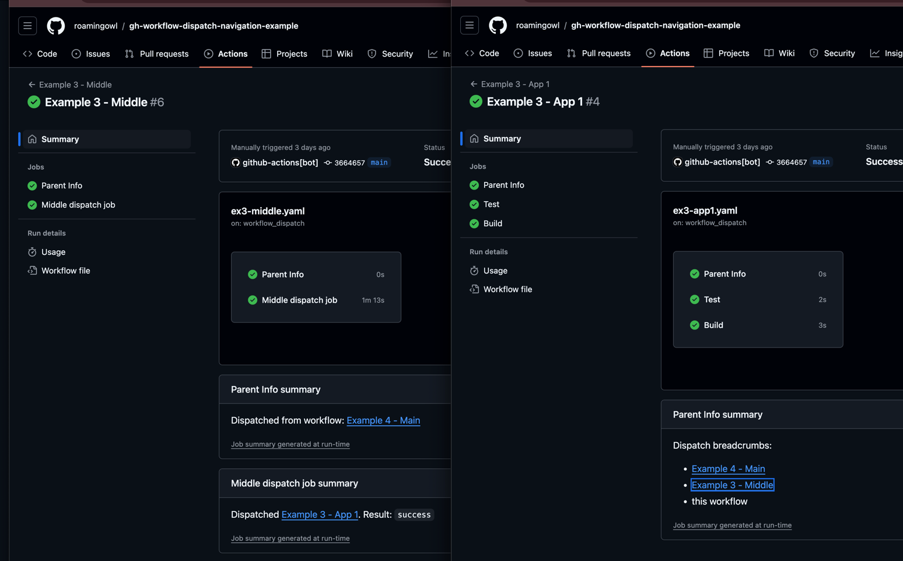

# GitHub workflow dispatch navigation example

> [!NOTE] 
> This is an example rpo to my blog post How to connect dispatching and dispatched workflows on Hashnode

When you dispatch one workflow from another, 
there is no connection between them except of the URL in the logs 
(if you use this action https://github.com/marketplace/actions/workflow-dispatch-and-wait), 
but that is it:

In this repository, 
I'm showing a few examples of how we can connect those two workflows and how to pass data between them.

## Example 1: Passing data between workflows

Workflow file(s): 
- dispatcher: [ex1-main.yaml](.github/workflows/ex1-main.yaml)
- dispatched: [ex1-app1.yaml](.github/workflows/ex1-app1.yaml)

Dispatcher workflow summary:

Dispatched workflow summary:

## Example 2: Dispatching workflow from another repository

Workflow file(s):
- dispatcher: [ex2-main.yaml](.github/workflows/ex2-main.yaml)
- dispatched: [gh-workflow-dispatch-navigation-second-example/ex2-app1.yaml](https://github.com/roamingowl/gh-workflow-dispatch-navigation-second-example/blob/main/.github/workflows/ex2-app1.yaml)

Dispatched workflow summary:

Token permissions:

## Example 3: Multi-level dispatch - first try

Multi level dispatch - a static just 3 level dispatching example.

Workflow file(s):
- dispatcher: [ex3-main.yaml](.github/workflows/ex3-main.yaml)
- 2nd level dispatcher: [ex3-middle.yaml](.github/workflows/ex3-middle.yaml)
- dispatched: [ex3-app1.yaml](.github/workflows/ex3-app1.yaml)

Dispatched workflow summary:  

## Example 4: Multi-level dispatch - second try

Multi level dispatch - with custom actions

Workflow file(s):
- dispatcher: [ex4-main.yaml](.github/workflows/ex4-main.yaml)
- 2nd level dispatcher: [ex4-middle.yaml](.github/workflows/ex4-middle.yaml)
- dispatched: [ex4-app1.yaml](.github/workflows/ex4-app1.yaml)

Actions:
- parent info [action](.github/actions/parent-info) - displays parent info in dispatched workflow - supports any level of dispatching
- metadata prepare [action](./.github/actions/prepare-meta) - automatically prepares metadata and construction an array of dispatch info

